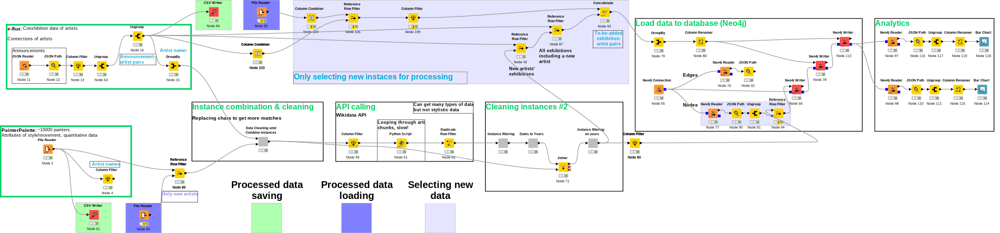
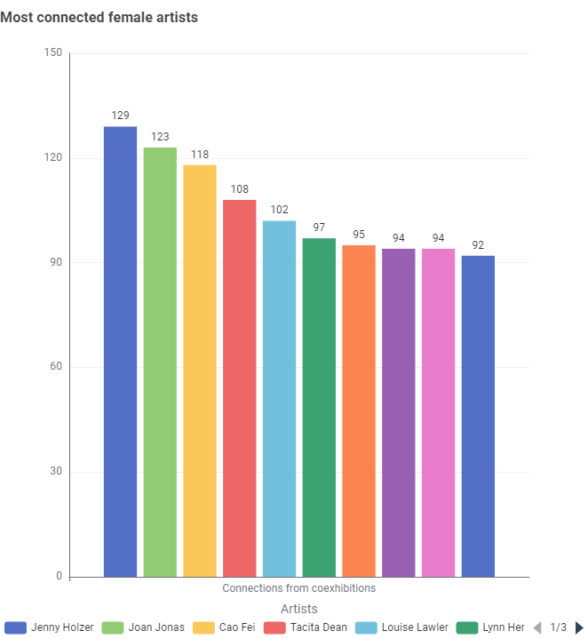
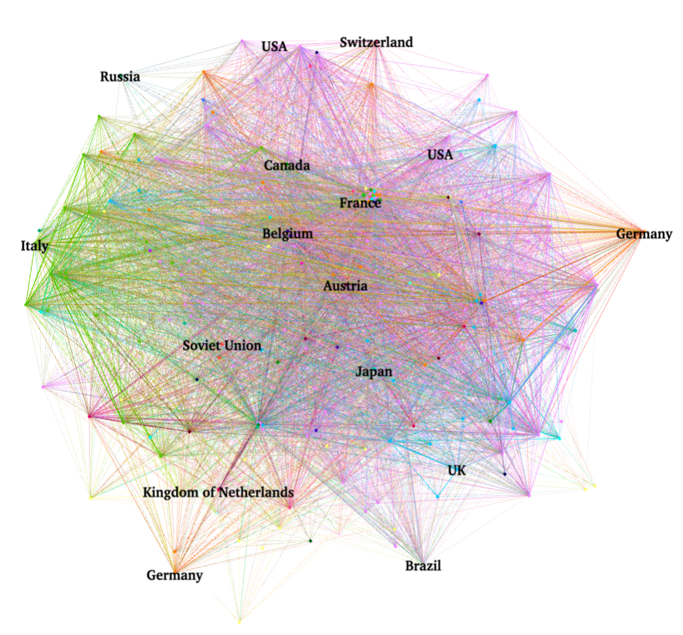

# Painter coexhibition network creation and analytics, using Neo4j and KNIME



Project at the [Central European University](https://www.ceu.edu/), by:<br>
Alina Kurmantayeva, <br>
Greta Zsikla, <br>
Mihaly Hanics, <br>
Peter Bence Torok.

Check out the [presentation](Presentation.pdf).

## Summary

The aim of our project was to create a dynamic painter network for analysis, and store it in a graph-based database.<br>
A KNIME pipeline automatically loads (new) artists and artist coexhibitions into a Neo4j database after enriching the data using the Wikidata API.<br>

By integrating two sources of data: the [PainterPalette dataset](https://github.com/me9hanics/PainterPalette) (which provides quantitative information about painters, including number of pictures per style) and coexhibitions of artists based on the e-flux website, we create a network of artist coexhibitions.

The pipeline created in KNIME processes the two datasets, cleans and robustly joins the artist names, and enriched through the Wikidata API, stored in a Neo4j database for analysis, and visualized in Gephi. We used clustering / community detection methods to identify artist communities, understanding to what extent nationalities and other aspects create homophily in the network, and exploring common attributes over the graph.

## Technical details

The pipeline to extract, transform and load (ETL) and analyze data was created in KNIME, involving five major stages: data reading, data cleaning, API enrichment, loading the data into Neo4j, and analytics. Neo4j is the most prominent graph database, ideal for storing our network using their AuraDB Server, for free. The choice of API was the Wikidata API, as it is an extremely rich knowledge database that is free to query (within limits). Additionally, Gephi was used for visualization to get insights into artist communities, regional influence, and collaboration trends.

### Data reading and cleaning

The first stage in the pipeline involves data import and preprocessing, where quantitative data was imported from the PainterPalette dataset and artist-exhibition pairs from e-flux announcements using File Reader and JSON Reader nodes. Filters and transformations using nodes such as Column Filter and GroupBy were applied to ensure the data was structured well.<br>
Non-alphabetical characters, double spaces, capital letters etc. were replaced in both datasets to standardize the artist names and increase join matches.

The data cleaning and integration stage  increased join matches by 140. The two artist tables were then joined into a single one, including all attributes. Processed outputs are saved and loaded in, to increase recurrent runs (see below in more detail).

### Artist data enrichment using the Wikidata API - SparQL with parallel querying

The artist data enrichment stage used the Wikidata API to add the following attributes to unseen artists:

- birth and death dates and places
- citizenship
- gender
- list of occupations 
 
A Python script constructed, called SparQL queries and handled results. An example of a query:

```sql
SELECT ?person ?personLabel ?dateOfBirth ?dateOfDeath ?placeOfBirthLabel ?placeOfDeathLabel ?citizenshipLabel ?genderLabel ?occupationLabel
WHERE
{
  ?person wdt:P31 wd:Q5.
  ?person wdt:P106 ?occupation.
  ?person wdt:P569 ?dateOfBirth.
  OPTIONAL { ?person wdt:P570 ?dateOfDeath. }
  OPTIONAL { ?person wdt:P19 ?placeOfBirth. }
  OPTIONAL { ?person wdt:P20 ?placeOfDeath. }
  OPTIONAL { ?person wdt:P27 ?citizenship. }
  OPTIONAL { ?person wdt:P21 ?gender. }
    SERVICE wikibase:label { bd:serviceParam wikibase:language "en". }
}
```

This is similar to SQL but with extra caveats: properties are defined by their Wikidata IDs (e.g. the property P20 means place of birth, and P31 means "instance of") - with question marks indicating variables we can gather the values of these properties. At the line `?person wdt:P31 wd:Q5.` we are restricting for instances to humans (the Q5 entity is human).<br>
Strings have language tags (e.g. a country can have a different name in different languages) and for this reason we can use labels to get the name of the entity in a specific language (and make it human readable). To try all languages , one can use `[AUTO_LANGUAGE]` instead of a specific language.

To query multiple artists at once, the query can be modified with `VALUES ?personLabel {{string_of_names}}` to get the data for multiple artists at once, which is much faster - however this often misses some artists.

To increase speed and not run into API fetching limitations, we queried artists in paralel in batches of 100. After receiving the responses, we re-query separately for each artist 

### Neo4j database loading and analytics
The cleaned and enriched dataset was integrated into a Neo4j graph database, where artists were represented as nodes and co-exhibitions as edges.<br>
A free version of the online AuraDB Server was used, so all contributors access the same database.

Neo4j's querying capabilities enabled network analysis to identify patterns of artistic collaboration, supporting interactive exploration and visualization of the painter network. Cypher queries extracted deeper insights - to run these queries programmatically, we used the Neo4j Reader nodes in KNIME and processed the JSON response. Some of the results were visualized with bar charts.



### Computational improvements
We have also designed the pipeline to make use of already processed data, and only query the API and load into the database new information, i.e., do not run the same artist queries again. This highly increases the speed of the pipeline, and the database updating process.

The process-only-new-information logic is represented in the following flowchart:


### Gephi visualization

Outside the pipeline, Gephi was used for network visualization to apply modularity clustering and centrality analysis. It was chosen for its ability to process large datasets and integrate with Neo4j, allowing clear visualization of artist connections and regional influences.



## Data model

The data model is designed as a graph structure with nodes representing artists (label: Artist) and edges representing coexhibitions (label: "COEXHIBITED_WITH"), to show connections between artists who participated in the same exhibition. Each artist is represented by a single node.

### Analytics findings

The analytics conducted through Gephi and Neo4j. Gephi's modularity clustering (community detection) highlighted distinct artist communities based on co-exhibition patterns, while centrality analysis identified geographic regions, such as Germany, France, and the USA, as key hubs for artistic collaboration. The visualizations also showed the connections between clusters and how some artists link different groups.

Neo4j analytics offered deeper insights into the dataset. Queries revealed that Andy Warhol, Liam Gillick, and Hito Steyerl were the most frequently exhibited artists, collectively participating in over 750 exhibitions. It was also found that most artists in the network died in New York, while the majority were born in Europe, highlighting the significance of Europe as a birthplace for artists and New York as a major cultural hub. Additionally, movements such as Conceptual Art, Expressionism, and Abstract Art were identified as creating the strongest connections between artists, while 20% of the artists showed minimal network engagement. These results highlighted important patterns in artistic collaboration and influence.

## Conclusion

This project created a painter network by integrating datasets and analyzing co-exhibition patterns. Using KNIME, the data was cleaned, standardized, and enriched with additional details through APIs. The enriched data was stored in a Neo4j graph database, where artists were represented as nodes and co-exhibitions as edges. Gephi was used for visualization to identify artist communities and influential regions. The results showed key hubs like Europe and New York, frequently exhibited artists such as Andy Warhol, and strong connections in movements like Conceptual Art and Expressionism. This work provides a practical framework for analyzing artistic collaboration and studying trends in the art world.

